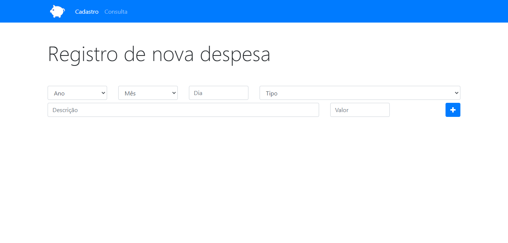
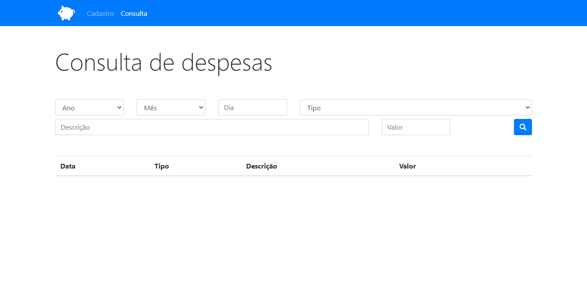

# App Orçamento Pessoal
Projeto criado através da plataforma Udemy no curso Desenvolvimento Web Completo.
## Deploy da aplicação

https://persbudgt-app.netlify.app/

## Tecnologias utilizadas

+ HTML5
+ CSS3
+ Bootstrap
+ JavaScript

## Estrutura do site

+ Cadastro: O usuário poderá cadastrar diversas despesas preenchendo os campos solicitados.
+ Validação: Os dados só serão salvos se o preenchimento dos campos estiverem corretos, caso contrário o sistema exibe um alerta de correção.
+ Local de Armazenamento dos dados: Os dados ficam salvos no Local Storage do navegador.
+ Consulta: é possível acessar os dados na aba consulta, assim como aplicar diversos filtros separados ou associados.

## Tela Cadastro

## Tela Consulta

